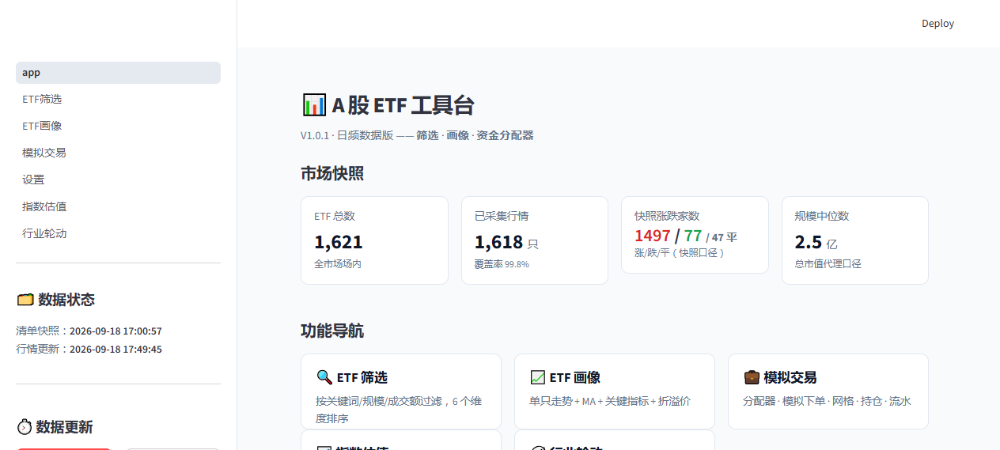
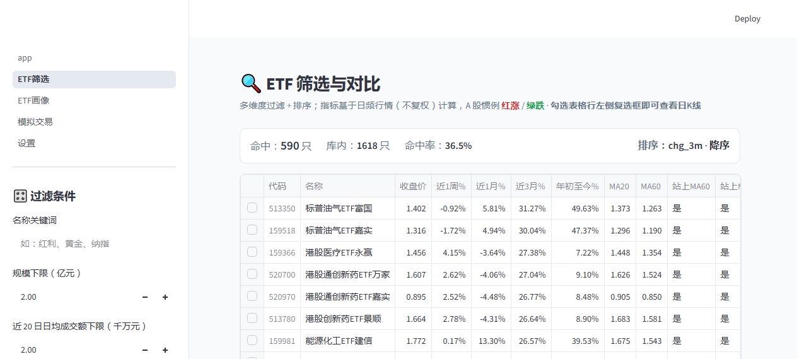
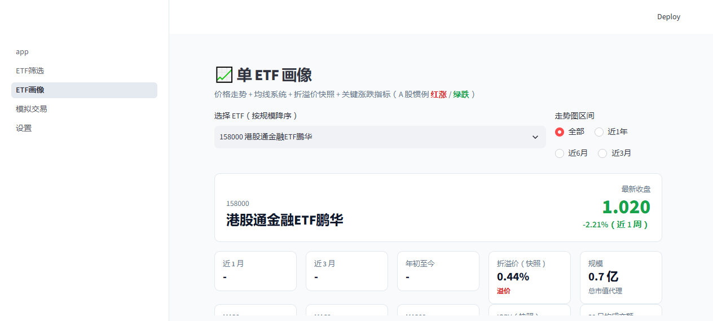
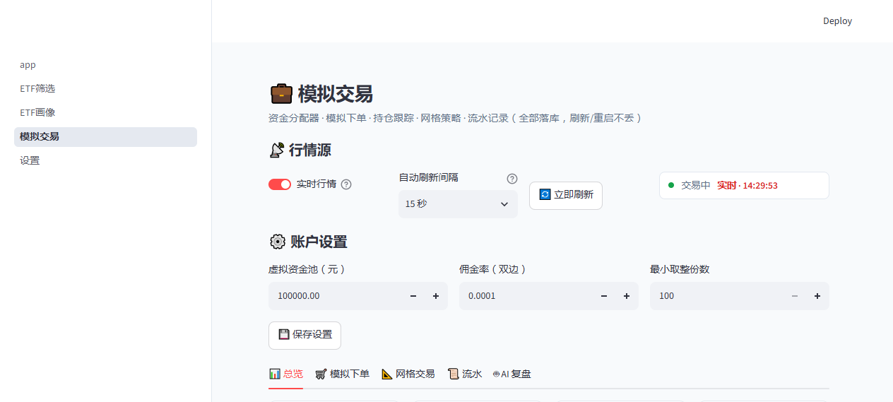
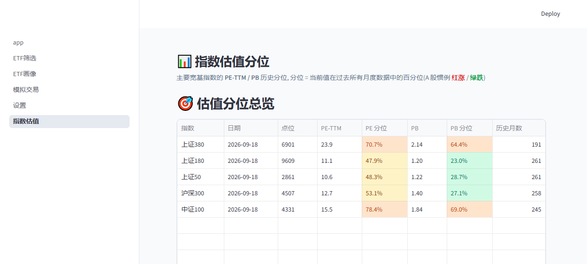
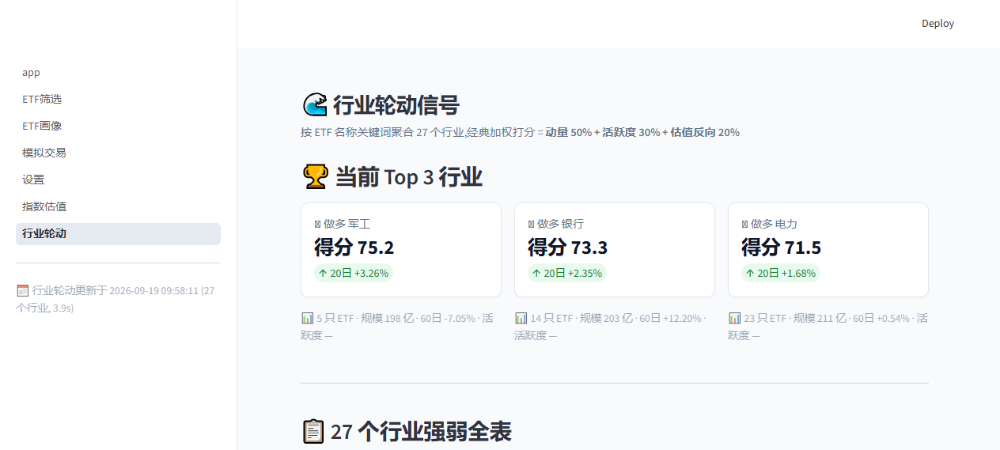

# A股 ETF 工具台

> 一站式的 A 股 ETF 研究、回测与模拟交易工作台。基于 Streamlit + SQLite，开箱即用。


## ✨ 特性

- **🎯 多维度 ETF 筛选**：关键词、规模、成交额、数据长度、按动量/规模/成交额排序
- **📊 单 ETF 画像**：近1周/1月/3月/年初至今涨跌、MA20/60/200、折溢价、IOPV、走势图
- **💰 资金分配器**：总资金 + 权重策略（等权/手动）→ 100 份取整的可执行清单 + 偏离检查
- **💼 模拟交易**：建仓/卖出/自动记录、浮动盈亏、成交流水
- **📐 网格交易**：可视化网格档位、当前价驱动档位判断（🟥买/🟩卖/➖持）、15 秒实时刷新
- **🤖 AI 持仓复盘**（可选）：用 DeepSeek / OpenAI / 自定义 LLM 给持仓/网格做复盘，自动 fallback 应对 reasoning 模型截断
- **🔄 实时行情**：新浪源（5只 0.19s / 50只 0.16s），避开东财 push2 限流
- **📊 指数估值分位**（V1.3 新增）：主要宽基 PE-TTM / PB 历史分位，5 档色块
- **🌊 行业轮动信号**（V1.3 新增）：27 个行业 ETF 池强弱打分（动量 50% + 活跃度 30% + 估值反向 20%）
- **📦 一键更新**：侧栏按钮支持「规模前 300」/「全量」/「指数估值」/「行业轮动」四种模式，可加 Windows 任务计划

## 🚀 快速开始

### 🪟 Windows 用户：一键快速安装（推荐）

> 无需安装 Python，无需手动配置环境，下载后双击即可安装。
>
> **[⬇️ 下载 Windows 一键安装包 ETF-Tools-Setup-v1.3.exe](https://github.com/weiyuan0917-a11y/etf-dashboard/releases/download/V1.3/ETF-Tools-Setup-v1.3.exe)**
>
> [查看 V1.3 Release 页面](https://github.com/weiyuan0917-a11y/etf-dashboard/releases/tag/V1.3)

1. 点击上方链接下载安装包 `ETF-Tools-Setup-v1.3.exe`
2. 双击安装，完成后勾选“启动 ETF 工具台”
3. 浏览器会自动打开本地页面；程序使用内置 Python 运行时，无需安装 Python 或联网安装依赖

安装版会将本地数据保存在用户 AppData 目录。源码运行或需要自行更新依赖时，可继续使用下方 macOS / Linux / WSL 的命令方式（Windows PowerShell 同样适用）。

详细图文步骤：[docs/WINDOWS_QUICKSTART.md](docs/WINDOWS_QUICKSTART.md)

### 🐧 macOS / Linux / WSL

```bash
# 1. 克隆仓库
git clone https://github.com/weiyuan0917-a11y/etf-dashboard.git
cd etf-dashboard

# 2. 安装依赖
python3 -m pip install -r requirements.txt

# 3. 采集数据（首次约 3-5 分钟：清单 + 规模前 300 只近 3 年日频行情）
python3 collector/update.py
# 可选：python3 collector/update.py --all  全量采集

# 4. 启动看板
python3 -m streamlit run app.py
# 浏览器自动打开 http://localhost:8501
```

### 🐳 Docker（Coming soon）

打包成单容器部署的计划见 [issue tracker](#)。

---

第一次跑 `collector/update.py` 会创建 `data/etf.db` 并填充约 1600 只 ETF 的近 3 年日线数据（≈ 80 万行）。

## 📸 截图

> 数据为 2026-09-19 实跑：清单 1621 只、行情 1618 只、行业轮动 27 个、指数估值 5 只宽基历史完整。

| 主页 (V1.3) | 筛选 | 画像 | 模拟交易 |
|---|---|---|---|
|  |  |  |  |

| 指数估值 (V1.3) | 行业轮动 (V1.3) |
|---|---|
|  |  |

*（AI 复盘截图见 `pages/3_模拟交易.py` 末 tab，需先在「⚙️ 设置」填入 LLM key 才能用）*

## 🏗️ 技术栈

| 层 | 选型 | 理由 |
|---|---|---|
| Web | Streamlit 1.35+ | 纯 Python，无需前后端分离 |
| 数据 | akshare + 新浪直连 | 免费、稳定；东财被封后 fallback 到新浪 |
| 存储 | SQLite | 零部署、单文件、< 100 MB |
| LLM | openai SDK（兼容协议） | DeepSeek / OpenAI / 自定义服务随便切 |
| 图表 | streamlit native + 自绘 | 不引第三方图表库 |

## 📁 目录结构

```
etf-dashboard/
├── app.py                    # 主页入口
├── pages/                    # 筛选 / 画像 / 模拟交易 / 设置
│   ├── 1_ETF筛选.py
│   ├── 2_ETF画像.py
│   ├── 3_模拟交易.py         # 含网格、流水、AI 复盘
│   └── 4_设置.py             # LLM provider / API key 配置
├── collector/                # 数据采集
│   ├── etf_list.py           # 清单快照
│   ├── daily_quotes.py       # 日频行情（akshare 新浪源）
│   └── update.py             # 一键更新入口
├── metrics/indicators.py     # MA / 动量 / 振幅
├── live.py                   # 实时行情（新浪 hq.sinajs.cn）
├── llm.py                    # LLM 客户端（OpenAI 兼容）
├── storage.py                # SQLite 存储层
├── config.py                 # 配置
├── scripts/                  # AppTest 无头测试
└── data/                     # etf.db（gitignore，首次运行生成）
```

## ⚙️ 配置（可选）

**LLM 增强**：

1. 启动后进入「⚙️ 设置」页
2. Provider 选 `deepseek` / `openai` / `custom`
3. 填入 API key（DeepSeek 注册即有赠额）
4. 保存后「💼 模拟交易 → 🤖 AI 复盘」即可用

**每日自动更新（Windows 任务计划）**：

参考 `scripts/etf-task-template.xml`，配置为每天 15:30 收盘后运行 `python collector/update.py`。

## 🛣️ 路线图

- [x] V1.0 — 筛选 / 画像 / 资金分配
- [x] V1.1 — 模拟交易 / 网格交易 / 实时行情
- [x] V1.2 — LLM 持仓复盘
- [x] V1.3 — 指数估值分位 / 行业轮动信号
- [ ] V2.0 — 信号引擎（T+0/T+1 判定）/ 仓位预警分级推送
- [ ] V3.0 — 与 LongPort / 富途 API 打通实盘（保留人工确认）

## 🤝 贡献

欢迎提 Issue / PR：

- 🐛 Bug 报告：附上 `data/update.log` + 复现步骤
- 💡 新功能：在 Issue 里先讨论，避免重复造轮
- 📝 文档：README / 注释翻译 / 截图都欢迎

## ⚠️ 免责声明

本工具输出**仅供研究参考，不构成任何投资建议**。所有数据来自公开免费接口（akshare / 新浪），不保证准确性和及时性。投资有风险，决策需谨慎。

## 📄 许可证

[MIT](LICENSE) — 商业使用、修改、再分发都欢迎。
